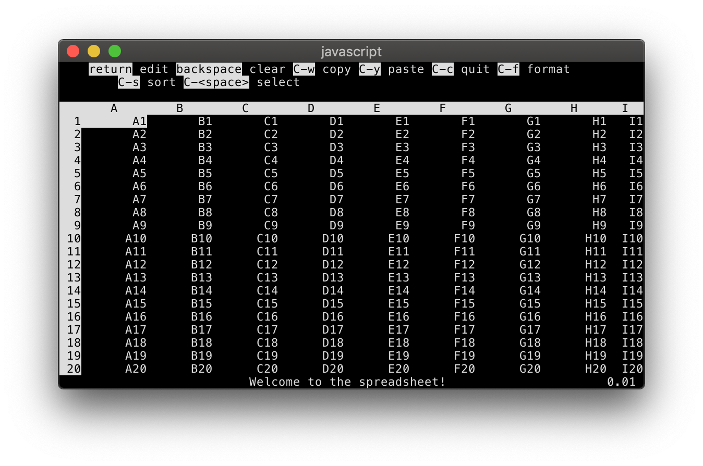

.. default-role:: code

We're building a text-UI spreadsheet app named `ss`. Here's what it looks like so far:

We've built the user interface (you'll get access right before the project starts)—your task is to design and build the spreadsheet engine based on the spec below.

.. contents::

Prep
----

1. Read through the spec below.
2. Think through your major design choices. **Note:** The design of this project is subtle and easy to botch, so you will be well served by thinking it through!
3. Email your interviewer any questions you have about the spec or project.
4. Set up a fresh environment of Python 3.7 (if using Python) or Node 10.x (if using Javascript).

Interview structure
-------------------

1. We'll start with a quick call where you can ask your interviewer any UX questions, talk through your plan, and make sure you can run `ss` usefully.
2. For the first 2.5 hours you'll work largely on your own to implement the spreadsheet engine. Your interviewer will check in with you after 1h30m to see how things are going.
3. From 2h30m to 3h30m, you and your interviewer will pair program for an hour on whatever you're working on.
4. From 3h30m to 4h, you'll wrap up by sketching out the design of whatever work you didn't finish implementing.
5. At 4h your interviewer will read the design doc and ask any final clarifying questions.

How you will be evaluated
-------------------------

Here are our criteria for evaluating the project. They're stack ranked, so please prioritize them accordingly.

1. **High quality design** that makes your engine easy to work with and change. Decoupled components talking to each other via clean and well-specified interfaces.
2. **User friendly details**--this spec is intentionally vague about many edge-cases or behavioral details. In these scenarios, it's up to you to choose the most user-friendly behavior. If you're not sure what behavior would be most user-friendly, talk it through with your interviewer.
3. **Extensibility.** You don't need to optimize for performance or write unit tests, but try not to make assumptions that would make high performance or testing impossible later.

You should prioritize *all* of these over finishing the entire spec. All we care about is being able to see the major elements of your design realized in code. If you are worried about running out of time, *aggressively drop things* that don't seem interesting from a design/user-friendliness perspective.

Finally, **don't worry about**:

- security
- small-scale code polish (e.g. extensive docstrings or comments, maximally readable variable names). We evaluated that in the last round and your interviewer will learn the codebase by pairing with you :)
- optimizing your code, unless it takes you over 1 second to execute a simple command
- actually writing unit tests (again, do worry about making it testable though!)

Spec
====

We've implemented the spreadsheet UI, but you need to implement the "engine" that actually stores and executes the spreadsheet computation.

We've defined the spreadsheet engine interface (see :ref:`engine`). You will implement parts of this interface (not all of it, unless you have lots of extra time at the end!).

At the end of this section, we'll tell you which parts to implement in which order. But first we need to explain how the spreadsheet is supposed to work in general.

The spreadsheet data model
--------------------------

A spreadsheet is (displayed as) a 2-dimensional grid of cells. The rows of the grid are lettered `A, B, ... Z, AA, BB, ..., AAA, ...`. The columns of the grid are numbered `1, 2, ...`. There is no limit to the number of rows or columns of the spreadsheet.

Many spreadsheet operations act on a single cell. A cell is **referenced** by the concatenation of its row and column, e.g. `A1` (column 1, row 1) or `ZZ590` (column 52, row 590). Some spreadsheet operations operate on a **range** of cells, written as two cell references separated by a colon (e.g. `A1:B3` is a 2x3 range). We will give you library functions for converting references and ranges to/from tuples; see the `ss.models` module.

Each cell contains a **value** which can be one of a few things:

* A **number** formatted like `1`, `1.23` or `6.02e23`
* A **datetime** formatted like `2018-01-01` or `2018-01-01 13:45:56`
* A **string** like `purple pandas`
* A **formula** like `= A1 + 2` (note that we will give you the code to parse a formula; see below.)
* The cell can also be **empty**.

Finally, each cell has a **format** which controls how it is displayed, which can be either:

* A **number format** using the syntax of `printf` (e.g. `%d`, `%.2f`)
* A **date format** using the syntax of `strftime` (e.g. `%Y-%m-%d`)
* The **default format** which displays numbers and dates however you want.

Formulae
--------

A **formula** is a cell value starting with `=`, followed by an expression which can either be:

* a **cell reference** like `A1`
* a **literal number or date** like `6.02e23` or `2018-01-01`
* a **binary operator** (`+-*/`) on two sub-expressions (**operands**), like `A1 * 6.02e23`
    * There must be spaces on each side of the operand. (Otherwise we couldn't tell whether `2018-01-01` was a date or equal to the value `2016`!)
    * All binary operators are valid to apply to 2 numbers. For dates, only addition and subtraction are defined. If you add a number to a date, you get a date that many days in the future. If you subtract two dates, you get the difference between them in days. You can't add two dates.
* a **function call** with any number of sub-expressions (**arguments**), like `sum(A1:B2, C3:D4)`. Function names are alphanumeric only and case-insensitive.

When printed, a cell with a formula should display the result of evaluating the formula. If a set of cell formulae causes a circular reference (for instance `set A1 = A2; set A2 = A1`) then it would be nice not to hang or crash.

**We will give you a pre-written `parse` function** to parse a formula string (without the `=` sign), because this function is boring and fiddly to write. See below for details.

Your tasks
----------

Here's the order you should do things in:

1. Get `set` and `get_raw` working.
2. Make `get_formatted` work correctly on formula cells with default formatting (i.e. return the evaluated formula). Don't worry about applying non-default formatting or defining any functions yet.
3. Implement a `sum(range)` function for formula evaluation, which adds together all the values in the given range.
4. (pairing) Get `set_format` working and make `get_formatted` apply the format string.
5. (with your interviewer) Discuss in broad strokes how you would implement:
    1. Unit tests for the code you just wrote.
    2. Making sure the UI always responds quickly to user input.
